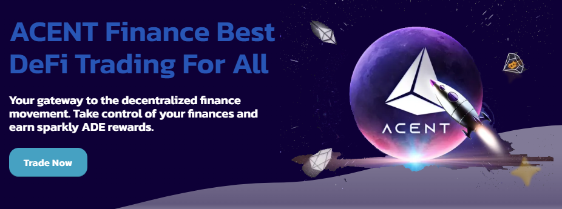

# AcentSwap Intro


**AcentSwap helps you make the most out of your crypto in three ways:**

**Trade, Earn, and Win.**


## ↔️ Trade

> Instantly swap crypto tokens: no registration or account needed.

### The people's choice

AcentSwap is the leading decentralized exchange on Acent Mainnet, with the highest trading volumes in the market (sources: [1](https://www.coingecko.com/en/exchanges/decentralized) [2](https://coinmarketcap.com/rankings/exchanges/dex/)).

### Low fees

Why pay more? AcentSwap runs on Acent Mainnet, a blockchain with much lower transaction costs than Ethereum or Bitcoin.\
Trading fees are lower than other top decentralized exchanges too, so that's a double win for you!

### Decentralized

Trade directly from your wallet app.\
Unlike centralized exchanges like Acent or Coinbase, AcentSwap doesn’t hold your funds when you trade: **you have 100% ownership of your own crypto**.

## 💸 Earn

> Earn ADE and other tokens for free with super high interest rates.

### Earn tokens with Syrup Pools

Stake ADE, earn free tokens. It’s really that easy.\
ADE holders right now are earning tens of millions of USD worth of free tokens each week from major projects. New projects join the party frequently, so you can earn more, for even longer.

### Earn ADE with Yield Farms

Stake LP tokens, earn ADE. You take on a little more exposure to market fluctuations than with the Syrup Pools, but can earn higher APR to offset the risk.

### Earn Trading Fees

No farm? No problem. Even if your trading pair isn’t supported on the Farms page, you can still earn trading fees when you stake your tokens in Liquidity Pools (LPs).

## 🎲 Win

> AcentSwap makes making money fun.

### Lottery

**Millions of dollars** regularly go up for grabs on the AcentSwap Lottery.\
Join as many as **11,000 daily players** for your chance to win big!

### Prediction

Win ACE if you can predict whether the ACE price will rise or fall.\
New rounds every 5 minutes!

### Pottery

Win a bigger yield on your ADE deposit, a combination of ADE lock-staking and lottery!

## Is AcentSwap safe?

See for yourself:

* Check out these AcentSwap security audits:
  * [Certik’s security audit of AcentSwap](https://www.certik.com/projects/acent) and [Certik's Shield insurance](https://shield.certik.foundation)
* Transparent:
  * We’re built on open-source software: our site and all our Smart Contracts are publicly visible for maximum transparency.
  * Our contracts are verified on AcentScan so you know that what you see is what you get: [1](https://bscscan.com/address/0x10ED43C718714eb63d5aA57B78B54704E256024E) [2](https://bscscan.com/address/0x73feaa1ee314f8c655e354234017be2193c9e24e#code) [3](https://bscscan.com/address/0xbcfccbde45ce874adcb698cc183debcf17952812) [4](https://bscscan.com/address/0x1b96b92314c44b159149f7e0303511fb2fc4774f#code) [5](https://bscscan.com/address/0x92E8CeB7eAeD69fB6E4d9dA43F605D2610214E68)
* Security best practices:
  * The chefs use multisig for all contracts.
  * Our contracts’ time-locks give you peace of mind.

**Sounds like fun?**\
**Then get flipping!**

***
