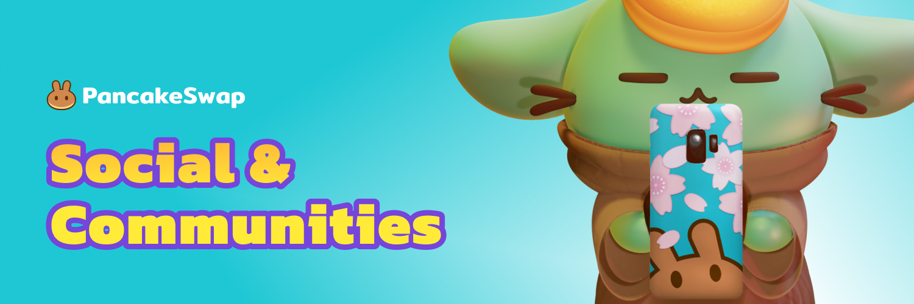

# Social Accounts & Communities

Here you'll find a list of AcentSwap's official Social media channels and communities. If English is not your first language, we have a number of non-English communities that would love to have you join them!

## 🐦 Twitter

[https://twitter.com/Acent_tech](https://twitter.com/Acent_tech)

## 📰 Blog (Medium)



## 🤳 Instagram



## 🤖Discord

Newly launched on 24th Nov! The below is the only link for our discord server!

[https://discord.gg/9Hvp4j8Q](https://discord.gg/9Hvp4j8Q)

## 💬 Telegram

**Official Telegram Groups:**

* 📣 Announcement Channel ([https://t.me/AcentChannel](https://t.me/AcentChannel))
* English ([https://t.me/AcentOfficialChat](https://t.me/AcentOfficialChat))


Admins will NEVER send you a direct message. If anybody approaches you directly on e.g. Telegram pretending to represent customer support, please block them and report spam.



**NEVER, under any situation, should you ever give someone your private key or recovery phrases. Immediately block and report anyone that asks for them.**

