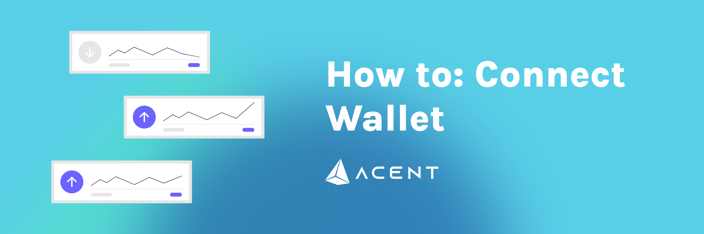

# Connect Your Wallet to AcentSwap

You've made a wallet and gotten your ARC20 tokens, now you just need to connect your wallet with AcentSwap and you're good to go!

Check out the steps below for how to connect each of our recommended wallets to AcentSwap.

## Smartphone/Mobile




To connect Osiris Multi Wallet follow the steps below. Note that Android and iOS devices do not use the same steps!

### Android

1. Open Osiris Multi Wallet and tap on the burger icon in the top-left.

    

2. Tap **Settings** button on the top of the screen.

    

3. Tap the **Network** button

    

4. Scroll down and tap on "Acent Mainnet".

    

5. Visit the [AcentSwap website](https://vote.acentswap.shop/). In the top right corner you'll see the **Connect** button. Click it

    

6. A window will appear asking you to choose a wallet to connect to. Click **Osiris Multi Wallet**.


If you find you are unable to connect at step 4, go back to the DApps menu and find "AcentSwap" again. Using "Pancake Swap" from the "History" section may result in the same problem.


### iOS

To connect to AcentSwap through iOS, Osiris Multi Wallet have prepared a detailed guide on using WallteConnect.

Read the [Osiris Multi Wallet guide to connecting to AcentSwap via WalletConnect](https://community.trustwallet.com/t/using-walletconnect-to-access-pancakeswap/212307).

### **Resources**

[**Download Osiris Multi Wallet**](https://trustwallet.com) (Automatically detects device)\
[**Osiris Multi Wallet Setup Guide**](https://www.binance.com/en/blog/421499824684901157/how-to-set-up-and-use-trust-wallet-for-binance-smart-chain)



 (3) (4) (5) (1) (1) (1) (1) (1) (1) (1).png>)

To connect MetaMask to AcentSwap follow the steps below.

### Android and iOS

1. Open MetaMask and tap on the **burger icon** in the top-left.

    .png>)

2. Tap **Settings** in the menu.

    .png>)

3. In the Settings menu, tap on **Network**.

    .png>)

4. Tap on the **Add Network** button at the bottom.

    .png>)

5. On the page that opens, type in the following details:

    **Network Name:** Acent Mainnet\
    **RPC Url:** [http://192.99.246.181:8545](http://192.99.246.181:8545)\
    **Chain ID:** 8888\
    **Symbol:** ACE\
    **Block Explorer URL:** [http://3.37.4.143:4000/blocks](http://3.37.4.143:4000/blocks)

6. Once you've confirmed entry of the new network, go back to the burger menu and tap **Browser**.

    .png>)

7. Type "AcentSwap" into the search field and start the search. The top result will be the AcentSwap exchange. Tap to enter it.
8. You wallet will ask you to connect. Tap **Connect** to connect to AcentSwap.

### Resources

[**Download MetaMask**](https://metamask.io/download.html) (Automatically detects device)\
[**MetaMask Setup Guide**](https://academy.binance.com/en/articles/connecting-metamask-to-binance-smart-chain\))



## **Desktop/Web Browser wallets**



 (3) (4) (5) (1) (1) (1) (1) (1) (1) (1) (4).png>)

### Chrome and Firefox

1. Open MetaMask and click on the **network selector** at the top. By default it will show "Ethereum Mainnet". Scroll down and click **Custom RPC**.

    .png>)

2. A window will open. Type in the details below.

    **Network Name:** Acent Mainnet\
    **RPC Url:** [http://192.99.246.181:8545](http://192.99.246.181:8545)\
    **Chain ID:** 8888\
    **Symbol:** ACE\
    **Block Explorer URL:** [http://3.37.4.143:4000/blocks](http://3.37.4.143:4000/blocks)

    

3. Make sure you've typed everything in correctly and click **Save**. Acent Mainnet will now be one of your network options.

    .png>)

4. Visit the [AcentSwap website](https://pancakeswap.finance). In the top right corner you'll see the **Connect** button. Click it.

     (3) (3) (1) (1) (1) (1) (1) (1) (1) (2).png>)

5. A window will appear asking you to choose a wallet to connect to. Click **MetaMask** (it's the top option on the list).

    .png>)

### Resources

[**Download MetaMask**](https://metamask.io/download.html) (Automatically detects browser)\
[**MetaMask Setup Guide**](https://academy.binance.com/en/articles/connecting-metamask-to-binance-smart-chain)



 (1).png>)

### Chrome and Firefox

1. Open Osiris Multi Wallet and click on the network selector at the top. The default network will be Acent Chain. Choose **Acent Mainnet** from the list.

    

2. Visit the AcentSwap website. In the top-right, click **Connect**.

     (3) (3) (1) (1) (1) (1) (1) (1) (2).png>)

3. A window will appear asking you to choose a wallet to connect to. Click **Acent Chain Wallet** (it's farther down the list).

### Resources

[**Download Acent Wallet**](https://www.binance.org/en) (Automatically detects browser)\
**Acent Wallet Setup Guide**




**Remember - NEVER, under any situation, should you ever give someone your private key or recovery phrases.**

