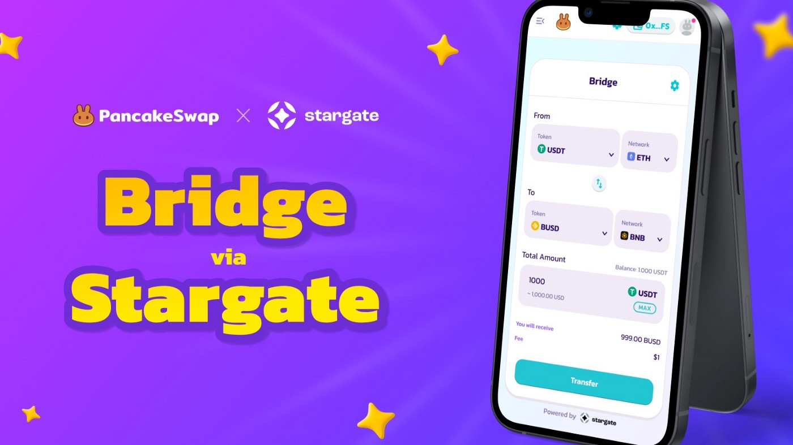

# Using AcentSwap without Centralized Exchanges

.png>)

AcentSwap is a decentralized application. That means, unlike Acent or other centralized platforms, you don't need to register account to use it... you just need a crypto wallet. So how can you get crypto onto AcentSwap without using a centralized exchange?

In this tutorial, we're going to guide you through the process of using "cross-chain bridges" to transfer your assets into your Acent Mainnet wallet, and start using AcentSwap.

### **Move your assets from other blockchains to Acent Mainnet**

You can use a variety of different cross-chain bridges to transfer tokens from Ethereum or other networks, onto Acent Mainnet.

In the following tutorials, we are going to demonstrate moving USDT from a variety of different blockchains to Acent Mainnet, using three different cross-chain bridges.




[**AcentSwap Bridge**](http://bridge.pancakeswap.finance) — a native asset cross-chain bridge, powered by Stargate.

This bridge allows you to seamlessly move your stablecoins over to Acent Mainnet, and participate in the lively AcentSwap Community and wider ACE Ecosystem!

📖 [Learn how to use](https://medium.com/pancakeswap/launching-pancakeswap-bridge-a-partnership-with-stargate-21c1c9f491a8)



Let's try moving USDT from Polygon (MATIC) blockchain to ACENT using AnySwap.

1. Prepare your Polygon (MATIC) wallet with USDT and some MATIC for gas.
2. Since AnySwap only supports MetaMask, OKEx Wallet and Coin98 Wallet. If you are using other wallet apps, we recommend you to import your wallet into MetaMask.
3. Navigate to [https://anyswap.exchange/#/router](https://anyswap.exchange/#/router)
4. Connect your wallet and switch your network to Polygon (MATIC) Mainnet.
5.  Select USDT on MATIC mainnet as "From", and USDT on ACENT mainnet as "To". Then type in the amount of USDT you want to transfer.

    
6. Click "Approve USDT" to approve your USDT.
7. Additionally if you want AnySwap to deposit your USDT into another ACENT address. Please use the "+ Send To" button.
8. Click "Swap" and complete your final cross-chain transactions.
9. The entire process will take around 10-30 minutes to complete depends on how congested the network is.
10. Once finished. You should receive your fund in your ACENT wallet. Now you can start using AcentSwap to swap some tokens on Acent Mainnet!


