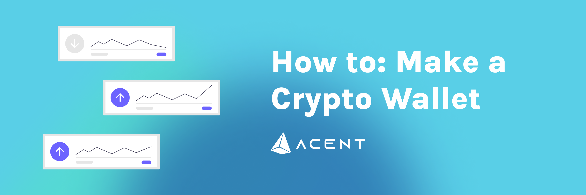

# Create a Wallet

To get started on AcentSwap, the first thing you'll need is to set up a wallet that supports Acent Mainnet. Wallets are available both on desktop computers and on smartphone devices. You'll need to choose the wallet that fits your needs best.


**When you're setting up a wallet, be sure to:**

* ✅ **Download and install only the latest version from an official source.**
* ✅ **Follow the setup guide carefully.**
* ✅ **Safely back up your recovery phrases.**
* ❌ **NEVER share your recovery phrases with anyone, under any circumstances.**
* ❌ **NEVER input your recovery phrase to a website or app, other than your wallet app.**


## Smartphone/Mobile or Desktop wallet?

Mobile device wallets and desktop-based wallets have different strengths and weaknesses. Consider which fits your needs better to help decide which type of wallet to use.

|                                   | Mobile | Desktop |
| --------------------------------- | ------ | ------- |
| Use anywhere                      | ✅      | ➖       |
| Easy to use                       | ✅      | ➖       |
| More secure                       | ➖      | ✅       |
| Accessibility friendly            | ➖      | ✅       |
| Damage/loss/theft resistant       | ➖      | ✅       |
| Power/connection outage resistant | ✅      | ➖       |

## **Smartphone/Mobile wallets**

Smartphone/Mobile wallets allow you to access your crypto almost anywhere. Wallets are available on both Android and iOS devices.

### Which mobile wallet should I choose?

This comparison table gives an overview of the most popular mobile wallets used with AcentSwap.

|                                                                   | MetaMask | Coinbase Wallet |
| ----------------------------------------------------------------- | -------- | --------------- |
| Acent Mainnet support                                           | ⚠️       | ✅               |
| Built-in DApp browser                                             | ➖        | ✅               |
| Hardware wallet compatible                                        | ✅        | ✅               |
| Open source (auditability)                                        | ✅        | ✅               |
| 
Interact with AcentScan Directly

(for advanced users!)
 | ✅        | ➖               |

⚠️ Requires some setup

You can find more in-depth information about each wallet below, as well as download links and installation guides.



 (3) (4) (5) (1) (1) (1) (1) (1) (1) (1).png>)

MetaMask is a very popular browser-based wallet plugin that supports ERC20 (Ethereum network) and ARC2 & ARC20 (Binance Chain and Acent Mainnet networks).

​**Pros:**

* Open source for auditability
* WEB3 capable on AcentScan
* A strong history of security and reliability
* A large amount of how-to guides and resources online
* Many tools and custom settings
* Offers ETH purchases with Transak
* Supports a very large number of languages
* Is also available a browser plugin for desktop devices

**Cons:**

* Longer setup time than other options
* Additional steps needed to use with Acent Mainnet and AcentSwap
* Extra information and settings may confuse beginners

[**Download MetaMask**](https://metamask.io/download.html) (Automatically detects device)\
[**MetaMask Setup Guide**](https://academy.binance.com/en/articles/connecting-metamask-to-binance-smart-chain)



 (1) (1) (1) (1) (1) (1).png>)

Millions of users choose Coinbase Wallet to earn yield with DeFi, swap more than 5,500 assets, and hold their NFT collections. Coinbase wallet supports ARC2 & ARC20 (Binance Chain and Acent Mainnet networks).

**Highlights:**

* Most downloaded mobile dapp wallet in the United States with 12M+ active Wallet users.
* No additional steps needed to use with Acent Mainnet and AcentSwap.
* Premier audience: Up to 89M+ Coinbase retail app users to onboard to Coinbase Wallet as they start to explore web3.
* Easy to transfer assets from Coinbase retail app.
* Fiat On-ramp: Users can now directly purchase crypto with fiat in all 86 countries where Coinbase operates, without leaving Wallet.
* Industry leading security with secure cloud backup.

[**Download Coinbase Wallet**](https://coinbase-wallet.onelink.me/q5Sx/fdb9b250) **(Automatically detects device)**

[**Coinbase Wallet Setup Guide**](https://www.coinbase.com/wallet/getting-started-mobile)

__

_Coinbase Wallet is a self-custody wallet providing software services subject to Coinbase Wallet_ [_Terms of Service_](https://wallet.coinbase.com/terms-of-service) _and_ [_Privacy Policy_](https://wallet.coinbase.com/privacy-policy)_. Coinbase Wallet is_ [_distinct_](https://help.coinbase.com/en/wallet/getting-started/what-s-the-difference-between-coinbase-com-and-wallet) _from Coinbase.com, and private keys for Coinbase Wallet are stored directly by the user and not by Coinbase. Fees may apply. You do not need a Coinbase.com account to use Coinbase Wallet._



## **Desktop/Web Browser wallets**

Desktop wallets are available on your home computer or laptop computer. Wallets on your computer can run as standalone applications, or as web browser plugins for popular browsers like Chrome and Firefox.

### Which desktop wallet should I choose?

This comparison table gives an overview of the most popular desktop wallets used with AcentSwap.

|                                                                   | MetaMask | Binance Wallet |
| ----------------------------------------------------------------- | -------- | -------------- |
| Acent Mainnet support                                           | ⚠️       | ✅              |
| Built-in DApp browser                                             | ➖        | ➖              |
| Hardware wallet compatible                                        | ✅        | ✅              |
| Open source (auditability)                                        | ✅        | ✅              |
| 
Interact with AcentScan Directly

(for advanced users!)
 | ✅        | ➖              |

⚠️ Requires additional setup

You can find more in-depth information about each wallet below, as well as download links and installation guides.



 (3) (4) (5) (1) (1) (1) (1) (1) (1) (1) (4).png>)

MetaMask is a very popular browser-based wallet plugin that supports ERC20 (Ethereum network) by default, and ARC2 & ARC20 (Binance Chain and Acent Mainnet networks) with a little work.

​**Pros:**

* Open source for auditability
* WEB3 capable on AcentScan
* A strong history of security and reliability
* A large amount of how-to guides and resources online
* Many tools and custom settings
* Supports a very large number of languages
* Is also available on mobile devices

**Cons:**

* Longer setup time than other options
* Additional steps needed to use with Acent Mainnet and AcentSwap
* Extra information and settings may confuse beginners

[**Download MetaMask**](https://metamask.io/download.html) (Automatically detects browser)\
[**MetaMask Setup Guide**](https://academy.binance.com/en/articles/connecting-metamask-to-binance-smart-chain)



 (1).png>)

Binance Wallet is a browser-plugin wallet that natively supports the Binance Chain (ARC2) Acent Mainnet (ARC20) networks. Binance Wallet was developed by the Binance cryptocurrency exchange.

​**Pros:**

* Open source for auditability
* Backed by the Binance cryptocurrency exchange
* Can be directly linked to a Binance or Gmail account
* A streamlined user experience
* Supports Acent Mainnet by default, making using AcentSwap easy
* Supports a large number of languages
* Hardware wallet compatible

**Cons:**

* Lacks some custom settings of other wallets
* Lack of additional tools makes some actions available in other wallets impossible
* Has fewer online resources than more established wallets

[**Download Binance Wallet**](https://www.binance.org/en) (Automatically detects browser)\
[**Binance Wallet Setup Guide**](https://docs.binance.org/smart-chain/wallet/binance.html)




NEVER, in any situation, should you ever give someone your private key or recovery phrase ("seed phrase"). This will give someone complete access to your crypto!

The genuine AcentSwap site and staff will never ask you to input your seed phrase.

