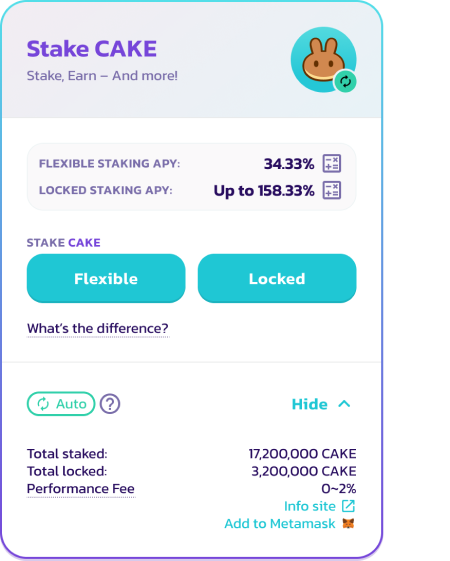

# New ADE Syrup Pool

## Stake ADE, earn ADE!

AcentSwap now offers one ADE Syrup Pool with two staking options: flexible staking or fixed-term staking. Note that the Auto ADE, IFO ADE, and Manual ADE pools will be retired upon the launch of the new ADE Syrup Pool with flexible and fixed-term staking. Keep reading on to learn more!

## What’s the difference between “Flexible” and “Fixed-Term” staking?

With both, you can simply stake your ADE tokens to earn more ADE tokens with no deposit fees—both staking options auto-compound ADE rewards for you. Flexible staking allows users to stake ADE and earn rewards with the ability to unstake whenever they please. Fixed-term staking allows users to maximise their yield and earn even more ADE by locking their staked ADE for a period of time they choose, earning a linearly boosted APY compared to flexible staking.

Flexible staking and fixed-term staking are both part of the same pool to allow users easy migration between the two staking options. **Because of this, you can only choose one staking option at a time.** More details about the differences are below.

### Flexible Staking

Stake your ADE and forget about it! The ADE you stake in this Syrup Pool will be automatically compounded (reinvested) for you, minus a small fee (same as the old Auto ADE Syrup Pool).

**If you have ADE staked in flexible staking**

* ✅ Add more ADE to flexible staking
* ✅ Harvest rewards any time
* ✅ Withdraw any time (fees apply for the first 72 hours, see below)
* ✅ Convert all staked ADE in flexible to fixed-term staking
* ❌ Add ADE to fixed-term staking if you have any ADE in flexible staking
* ❌ Convert part of the staked ADE in flexible to fixed-term staking

**Unstaking fee**

* **0.1%
 if you unstake (withdraw) within 72 hours.**
* Only applies within 3 days of manually staking.
* After 3 days, you can unstake with **no fee**.
* The 3-day timer resets every time you manually stake more ADE in the pool.
* This fee only applies to manual unstaking: it does not apply to automatic compounding.

**Performance fee**

* **2%, subtracted automatically from each yield harvest**.
* For example, if the harvest were 1 ADE, then 0.02 ADE would be subtracted as the performance fee.

The ADE collected via the unstaking fee and performance fee is **burned every week** as part of the regular ADE token burns.

This is a good thing for ADE holders because it reduces the overall amount of ADE tokens in existence, which helps reduce inflation.

### Fixed-Term Staking

Stake your ADE for a fixed amount of time to maximise yields and receive additional benefits! The staked ADE will be automatically compounded during the entire lock duration.

* No performance fees
* The longer you lock, the higher the boost applied to the yield! Always offering a higher APY compared to flexible staking!
* ADE rewards are auto-compounded and will unlock, along with your staked ADE, when your lock duration expires
* Once staked in fixed-term staking, you cannot withdraw until the end of your lock duration.
* IFO ADE credit (the maximum amount of ADE they can commit during an IFO) will be determined from the fixed-term staking pool

**If you have ADE locked in fixed-term staking**

* ✅ Add more ADE to lock
* ✅ Extend lock period
* ❌ Add ADE to flexible staking
* ❌ Harvest rewards
* ❌ Withdraw before locked term ends

Chefs are cooking up additional benefits in the kitchen for Q2!
