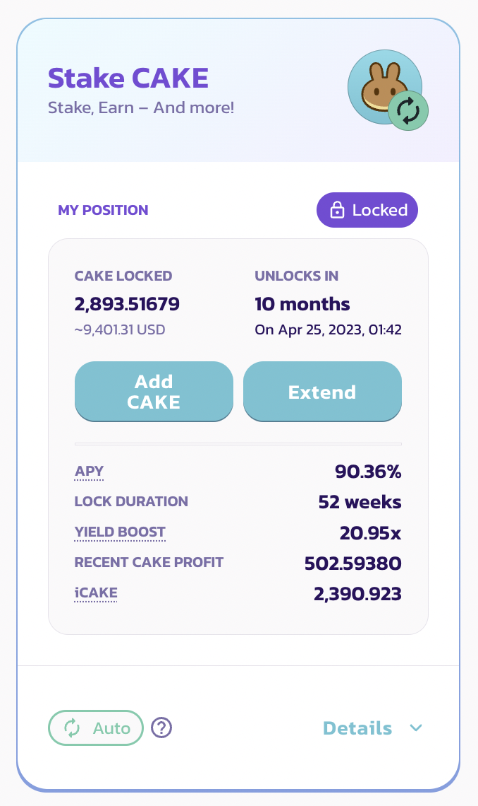
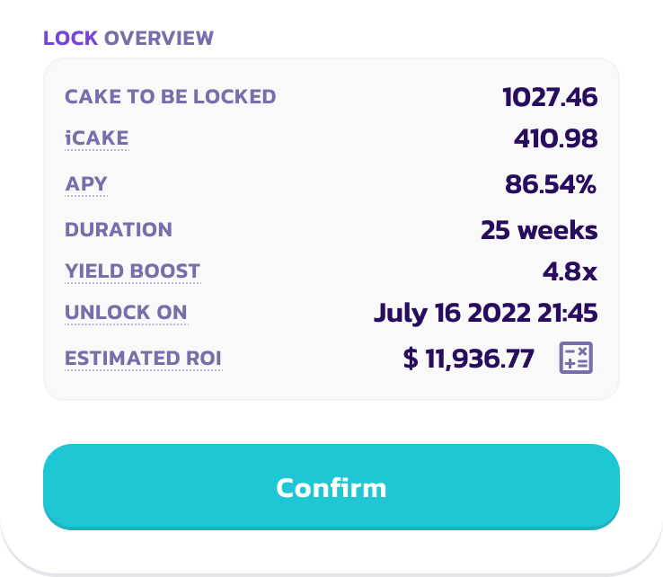

# iADE

### **What is iADE?**

iADE is similar to “IFO credits” from the previous IFO ADE staking pool, which was retired during the MasterChef v2 migration. After this update, iADE will determine the maximum ADE commit limit in the AcentSwap IFO public sales. For example, if you have 200 iADE, you will be able to commit 200 ADE in any upcoming IFO public sales.

**iADE is NOT a new token, it is a numerical metric being used by the AcentSwap IFO system.**

### How is iADE calculated?

The number of iADE you have is based on the number of ADE staked in the fixed-term ADE staking pool and the total staking duration of your current fixed-term staking position.

iADE works based on a staking duration threshold for all iADE users.

If your staking duration is above the threshold, the number of iADE you have is equal to the number of the ADE in your staking position.

If your staking duration is below the threshold, the number of iADE you have will be linear decreased and adjusted.

If your staking position is ended, the number of iADE you have is 0.

For example, if the threshold is 20 weeks:&#x20;

* Your current fixed-term staking position has a duration of 25 weeks and 200 staked ADE. Then the number of iADE you have is 200.&#x20;
* Your current fixed-term staking position has a duration of 10 weeks and 200 staked ADE. Then the number of iADE you have equals 200 × (10 ÷ 20) = 100.&#x20;
* Your current fixed-term staking position has a duration of 2 weeks and 200 staked ADE. Then the number of iADE you have equals 200 × (2 ÷ 20) = 20.&#x20;
* Your current fixed-term staking position has a duration of 2 weeks and 200 staked ADE. But the position is ended. Then the number of iADE you have is 0.

|                  | Your staking duration is equal to or longer than the threshold | Your staking duration is shorter than the threshold                  |
| ---------------- | -------------------------------------------------------------- | -------------------------------------------------------------------- |
| **iADE Amount** | Equals your Locked ADE Amount                                 | Equals your Locked ADE Amount x (Your Staking Duration / Threshold) |

### How to check the number of iADE I have?

You can check the number of iADE you have in the IFO page [here](https://pancakeswap.finance/ifo).

### **How to increase the number of iADE I have?**

You can increase the number of iADE you have by:

* Adding more ADE to your fixed-term staking position in the ADE syrup pool.
* Extend your fixed-term staking durations if your current durations is shorter than the threshold.

********

You can preview the number of iADE generated from your staking position when adjusting or initializing the fixed-staking.

### What is the threshold for iADE calculations?

Between each IFOs, the kitchen will optimize the threshold based on the average staking duration of the fixed-term staking ADE pool. The adjustment will be published on all social channels.

.png>)

You can check the current threshold for iADE calculations by hovering or tapping the underlined iADE text in the ADE syrup pool window.
