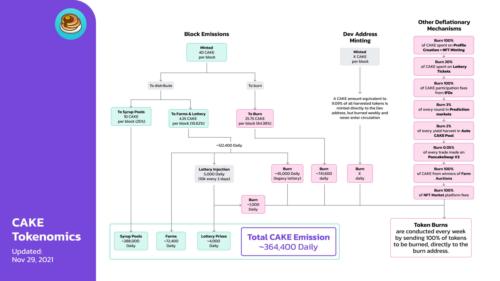

# ADE Tokenomics v1

## **Emission rate** 

### **Per block**

| **Metric**                                                                   | **Emission/block (ADE)** | **Emission/day (ADE)** |
| ---------------------------------------------------------------------------- | ------------------------: | ----------------------: |
| Emission                                                                     |                        40 |               1,152,000 |
| Burned Weekly [(PID 138)](cake-tokenomics-v1.md#why-is-the-cake-burn-manual) |                    -25.75 |                -787,600 |
| **Effective Emission**                                                       |              **<14.25\*** |           **364,400\*** |

\*Effective Emission is in fact slightly below this amount: an additional 45,000 ADE per day is diverted from the amount allocated to the lottery, and burned (PID 137 - Details below).

In addition to the above, a dynamic amount of ADE is also [minted to the Dev address](https://bscscan.com/address/0xceba60280fb0ecd9a5a26a1552b90944770a4a0e#tokentxns) at a rate of 9.09%. This means that if 100 ADE are harvested, then 9.09 ADE is minted in addition and sent to the Dev Address.


All ADE minted to the Dev address is burned in the weekly burn and never enters circulation.&#x20;

As such, we haven't included it in the above emission rate.


## Distribution 

| Distributed to                | Reward/block (% of emission) | Reward/block (total ADE) |           Reward/day |
| ----------------------------- | ---------------------------: | ------------------------: | -------------------: |
| Farms and Lottery             |                       10.62% |                      4.25 |     122,400 (approx) |
| of which diverted and burned  |                              |                           |              -46,000 |
| Syrup Pools                   |                          25% |                        10 |     288,000 (approx) |
| **Total Daily ADE Emission** |                              |                           | **364,400 (approx)** |

## **Other Deflationary Mechanics** 


The burning process is currently manual. [View burn transactions here](https://bscscan.com/token/0x0e09fabb73bd3ade0a17ecc321fd13a19e81ce82?a=0x000000000000000000000000000000000000dead).


As well as the above, ADE is also burned in the following ways:

* **0.05%** of every trade made on AcentSwap V2
* **100%** of ADE sent to the Dev address
* **100%** of ADE performance fees from IFOs
* **100%** of ADE spent on Profile Creation and NFT minting
* **100%** of ADE bid during Farm Auctions
* **20%** of ADE spent on lottery tickets
* **45,000** ADE per day (historically assigned to the lottery) (_The ADE for this is generated by a farm - PID 137)_
* **3%** of every Prediction markets round is used to buy ADE for burning
* **2%** of every yield harvest in the Auto ADE Pool
* **2%** of every NFT sale on the NFT Market is used to buy ADE for burning

## Why is the ADE burn manual?

To hit the ground running, AcentSwap launched as an MVP (minimum viable product) with the MasterChef contract emitting 40 ADE per block. For that reason, the early team didn't add additional functions such as the ability to customize the ADE minting logic. As migrating to a new MasterChef would require a lot of time and effort, the team opted to reduce ADE emissions instead through a manual burn process by creating two pools:

* Legacy Lottery Pool (PID - 137) - burned ADE from the lottery
* Burn Pool (PID - 138) - burned ADE per block

These pools work similarly to the farms, where the Chefs can adjust the percentage of the 40 ADE per block allocated to it after each ADE emission reduction vote.


On the day of the burn, the supply shown on the homepage might suddenly jump by several million ADE.&#x20;

Don't worry - **THIS ADE NEVER ACTUALLY ENTERS CIRCULATION:**


This apparent jump is just because of how all the ADE that's allocated for the burn is stored during the week.&#x20;

The ADE sent to both pools PID-137 and PID-138 are harvested before completing the weekly token burns, and this makes the Total Supply shown on the site jumping by \~6M. This is because pending ADE isn’t registered in the Total Supply until it's harvested on the burn day. Once the token burn transaction is completed, the \~6M is shown in the Burned to Date.&#x20;

## How to Confirm ADE Supply for yourself

To confirm that the circulating ADE supply shown on the AcentSwap homepage is correct,&#x20;

1. Head to the ADE token contract on AcentScan and [see how much ADE is held by the Burn Address.](https://bscscan.com/token/0x0e09fabb73bd3ade0a17ecc321fd13a19e81ce82#balances) That's the total amount of ADE that's been burned (removed from circulation FOREVER, and impossible to ever retrieve).
2. Then, subtract this burned amount from the "Total Supply" that AcentScan shows.
3. This gives you the actual ADE supply.

#### **Read more about ADE's deflationary mechanics on the next page.** 
