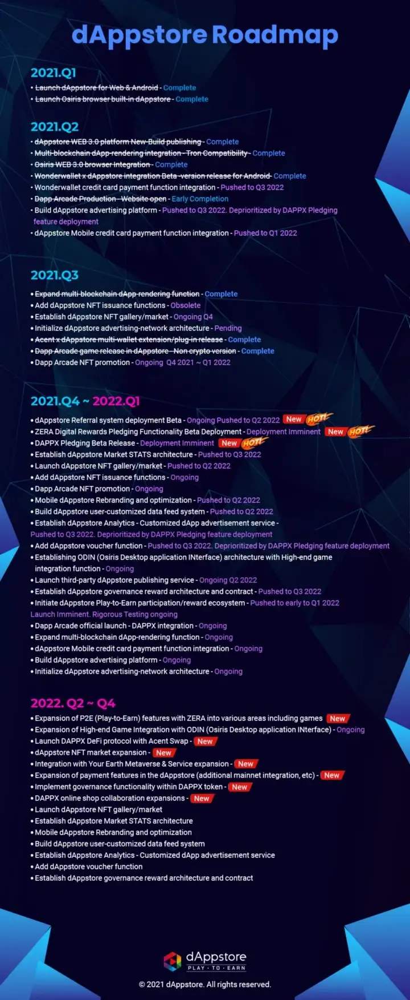

# Roadmap

This year, as part of the enhancements for the play-to-earn feature of dAppstore, we have focused on developing digital rewards through Zera. This would provide immediate value to the community as we make Zera tokens interoperable in almost all play-to-earn ecosystems of dAppstore. The pledging feature deployment of Zera is also imminent and we hope that the community will benefit from it.

We have also completed other features of the Osiris Web 3.0 browser, such as the multi-blockchain dApp rendering platform, Osiris metawallet, and others to make dAppstore a fully integrated system.

Rest assured that our team is highly focused and is working around the clock during the holidays to rigorously test and fix the bug of the pledging rewards feature. Nevertheless, we will continuously do our best to deliver great products and services throughout 2022!

Enjoy the remaining days of 2021 and Happy New Year to all!!!

To know more about dAppstore and its ecosystem visit our website and community platforms!

Good news! DAPPX token is already listed at [Kucoin](https://www.kucoin.com/ko/trade/DAPPX-USDT) exchange!!!

### Join us and stay updated on our progress on social media:
[Twitter](https://twitter.com/Acent_tech) | [Telegram1](https://t.me/dAppstoreOfficial) | [Telegram2](https://t.me/AcentOfficialChat) | [Facebook](https://www.facebook.com/FBACENT) | [Instagram](https://www.instagram.com/dappstore_official/) | [Youtube](https://www.youtube.com/channel/UCRFJkGCrTqcqHaFUjsrqrRA)
You can also check out our partners:
* [Acent.tech](https://acent.tech/) : Blockchain Technology behind dAppstore ecosystem
* [Your Earth](https://yourearth.io/) : Metaverse Application on the Acent blockchain made with Unreal Engine
* [Dapp Arcade](https://dapparcade.io/) : Retro Arcade style play-to-earn dapp

### Want to get hands-on experience of web 3.0 technology and its rewards-based habitat?
* Download the [Osiris Browser](https://acent.tech/)!

***
