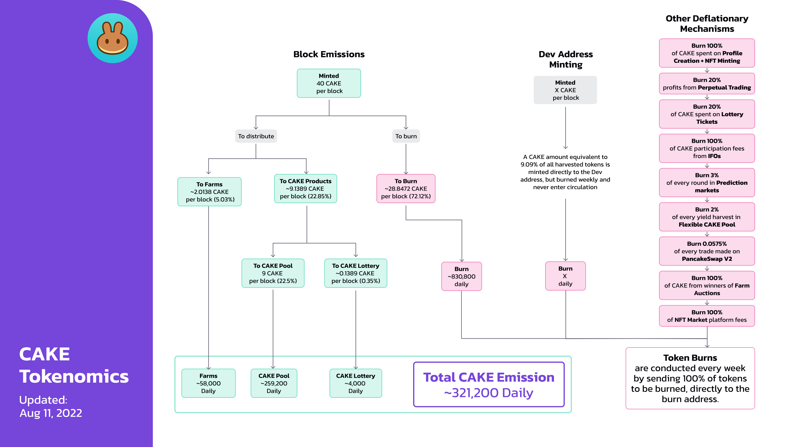

# ADE Tokenomics

## **Emission rate** 

### **Per block**

| **Metric**             | **Emission/block (ADE)** | **Emission/day (ADE)** |
| ---------------------- | ------------------------: | ----------------------: |
| Emission               |                        40 |               1,152,000 |
| Burned Weekly          |                   \~28.84 |               \~830,800 |
| **Effective Emission** |             **\~11.16\*** |         **\~321,200\*** |


On August 11, 2022, Chefs implemented some configuration upgrades to take full advantage of MasterChef v2. It eliminates the 45,000 ADE daily burn for the legacy lottery injections. Those burns will now be handled by MasterChef v2 directly along with the usual weekly ADE burn. Therefore, the effective emissions are now even lower.


In addition to the above, a dynamic amount of ADE is also [minted to the Dev address](https://bscscan.com/address/0xceba60280fb0ecd9a5a26a1552b90944770a4a0e#tokentxns) at a rate of 9.09%. This means that if 100 ADE are harvested, then 9.09 ADE is minted in addition and sent to the Dev Address.


All ADE minted to the Dev address is burned in the weekly burn and never enters circulation.&#x20;

As such, we haven't included it in the above emission rate.


## Distribution 

| Distributed to                | Reward/block (% of emission) | Reward/block (total ADE) |           Reward/day |
| ----------------------------- | ---------------------------: | ------------------------: | -------------------: |
| Farms                         |                      \~5.03% |                  \~2.0138 |      58,000 (approx) |
| Lottery                       |                      \~0.35% |                  \~0.1389 |       4,000 (approx) |
| ADE Syrup Pool               |                      \~22.5% |                       \~9 |     259,200 (approx) |
| **Total Daily ADE Emission** |                              |                           | **321,200 (approx)** |

## **Other Deflationary Mechanics** 


The burning process is currently manual. [View burn transactions here](https://bscscan.com/token/0x0e09fabb73bd3ade0a17ecc321fd13a19e81ce82?a=0x000000000000000000000000000000000000dead).


As well as the above, ADE is also burned in the following ways:

* **0.0575%** of every trade made on AcentSwap V2
* **100%** of ADE sent to the Dev address
* **100%** of ADE performance fees from IFOs
* **100%** of ADE spent on Profile Creation and NFT minting
* **100%** of ADE bid during Farm Auctions
* **20%** of ADE spent on lottery tickets
* **20%** of all profits from Perpetual Trading
* **45,000** ADE per day (historically assigned to the lottery)
* **3%** of every ACE Prediction markets round is used to buy ADE for burning
* **3%** of every ADE Prediction markets round
* **2%** of every yield harvest from all the flexible staking positions in ADE pool
* **2%** of every NFT sale on the NFT Market is used to buy ADE for burning

## Why is the ADE burn manual?

To hit the ground running, AcentSwap launched as an MVP (minimum viable product) with the MasterChef contract emitting 40 ADE per block. For that reason, the early team didn't add additional functions such as the ability to customize the ADE minting logic. The team has been controlling ADE emissions through a manual burn process by creating two pools in MasterChef v1:

* Legacy Lottery Pool (PID - 137) - burned ADE from the lottery
* Burn Pool (PID - 138) - burned ADE per block

These pools work similarly to the farms, where the Chefs can adjust the percentage of the 40 ADE per block allocated to it after each ADE emission reduction vote.

**However, in April 2022, AcentSwap migrated to a new MasterChef v2 contract.** The ratio of the ADE burn per block is finally controlled by a dedicated contract. This allows the burn to be much more accurate.


Due to MasterChef v2 occasionally harvesting the full 40 ADE per block. The supply shown on the homepage (or some 3rd party trackers) might suddenly jump by several million ADE.

Don't worry - **EMISSION IS NOW CONTROLLED CAREFULLY BY MASTERCHEF V2. ADE TO BURN WILL NEVER ACTUALLY ENTERS CIRCULATION!**


## How to Confirm ADE Supply for yourself

To confirm that the circulating ADE supply shown on the AcentSwap homepage is correct,&#x20;

1. Head to the ADE token contract on BscScan and [see how much ADE is held by the Burn Address.](https://bscscan.com/token/0x0e09fabb73bd3ade0a17ecc321fd13a19e81ce82#balances) That's the total amount of ADE that's been burned (removed from circulation FOREVER, and impossible to ever retrieve).
2. Then, subtract this burned amount from the "Total Supply" that BscScan shows.
3. This gives you the actual ADE supply.

#### **Read more about ADE's deflationary mechanics on the next page.** 
